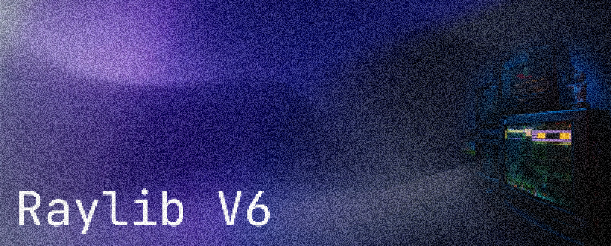

# Raylib 6 C++ Starter Template

A high-performance C++ game development environment using **Raylib 6**, **CMake**, and the **Ninja** build system. Optimized for **Clang/LLVM** on Windows.

## 📁 Project Structure

*   **`.vscode/`**: Local editor configurations (`launch.json`).
*   **`assets/`**: Game resources like textures, sounds, and shaders.
*   **`bin/`**: The final production folder containing `main.exe`.
*   **`build/`**: Temporary Ninja build artifacts (safe to delete).
*   **`src/`**: C++ source code files.
*   **`CMakeLists.txt`**: Build configuration and library management via FetchContent.

## 🛠️ Requirements

*   **CMake** (v3.16+)
*   **Ninja** build system
*   **Clang/LLVM** compiler (v22.1.4+)
*   **Raylib 6** (Automatically managed via CMake)
